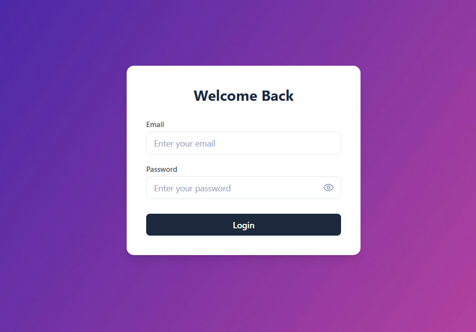
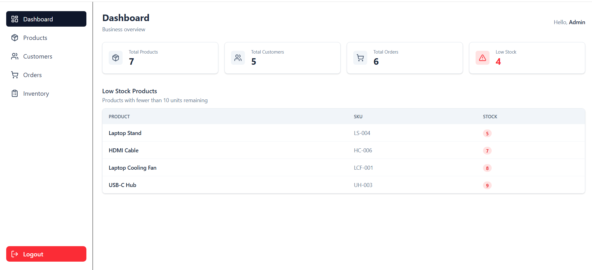
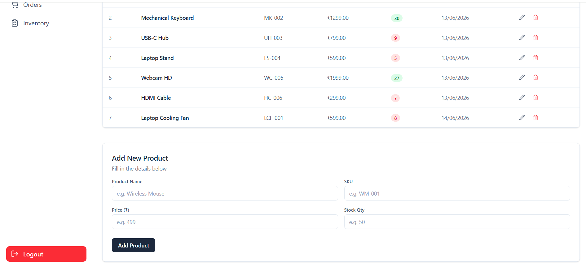
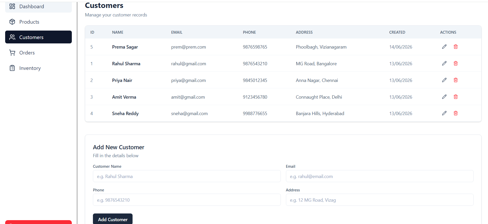
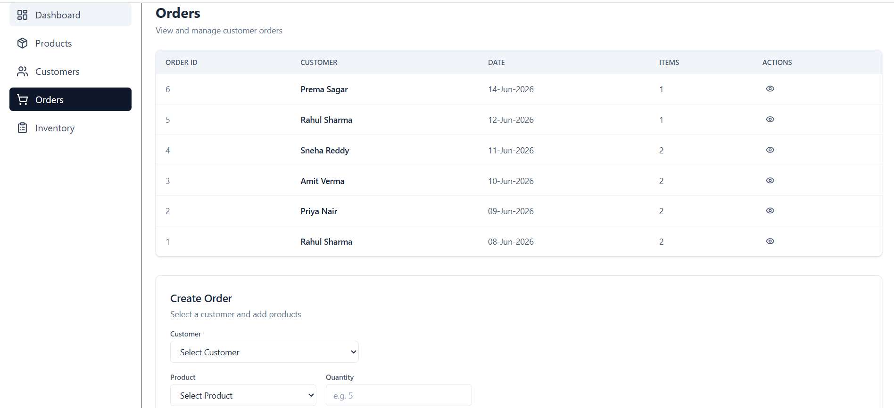
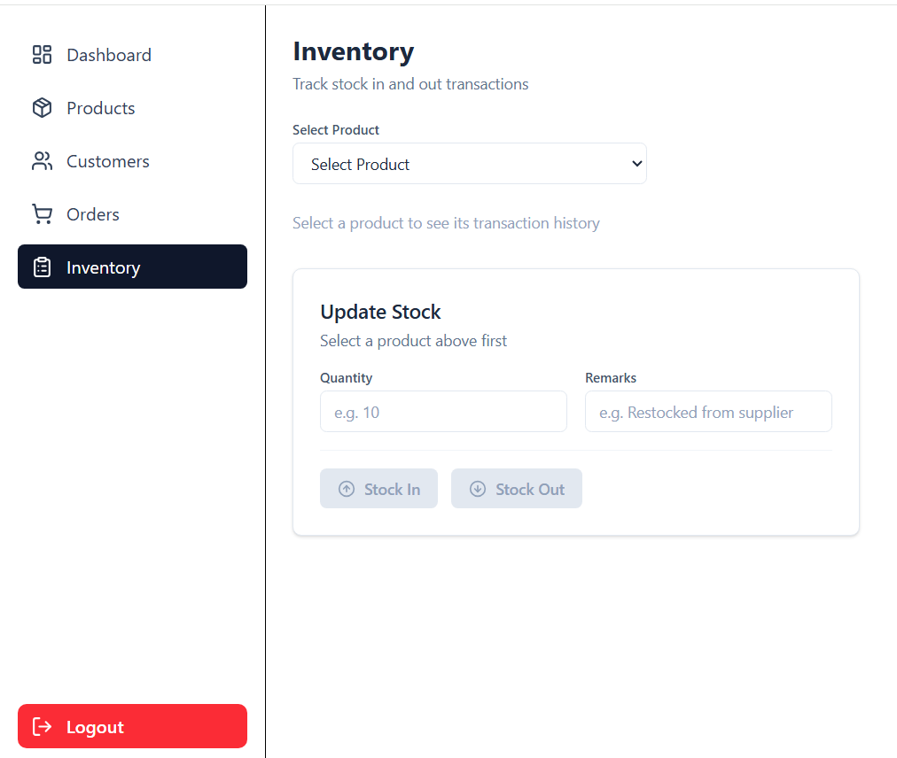

# 📦 Inventory Management System

[](https://inventory-management-system-five-ivory.vercel.app)

A full-stack Inventory Management System built using **React, Vite, Node.js, Express, and MySQL**. The application helps businesses manage products, customers, orders, stock movements, and inventory transactions through a modern web interface.

---

## 📷 Screenshots

### Login



### Dashboard



### Products



### Customers



### Orders



### Inventory



---

## 🚀 Features

### 🔐 Authentication & Authorization

- JWT-based authentication
- Protected routes
- Secure HTTP-only cookie authentication
- User session persistence

### 📊 Dashboard

- Total Products
- Total Customers
- Total Orders
- Low Stock Product Count

### 📦 Product Management

- Create products
- View product list
- Update product information
- Delete products
- Stock quantity tracking

### 👥 Customer Management

- Create customers
- View customer list
- Update customer information
- Delete customers

### 🛒 Order Management

- Create customer orders
- Add multiple products to an order
- Edit and remove order items before submission
- View order details
- Automatic stock deduction when orders are created

### 📈 Inventory Management

- Stock In operations
- Stock Out operations
- Inventory transaction history
- Current stock visibility
- Remarks for stock movements

---

## 🔌 API Endpoints

### Authentication

| Method | Endpoint        | Description                    |
| ------ | --------------- | ------------------------------ |
| POST   | `/users/login`  | Login user                     |
| POST   | `/users/logout` | Logout user                    |
| GET    | `/users/me`     | Get current authenticated user |

---

### Dashboard

| Method | Endpoint               | Description                  |
| ------ | ---------------------- | ---------------------------- |
| GET    | `/dashboard/summary`   | Dashboard summary statistics |
| GET    | `/dashboard/low-stock` | Low stock products list      |

---

### Products

| Method | Endpoint               | Description            |
| ------ | ---------------------- | ---------------------- |
| GET    | `/products`            | Get all products       |
| POST   | `/products`            | Create product         |
| PUT    | `/products/:productId` | Update product         |
| DELETE | `/products/:productId` | Delete product         |
| GET    | `/products/low-stock`  | Get low stock products |

---

### Customers

| Method | Endpoint                 | Description       |
| ------ | ------------------------ | ----------------- |
| GET    | `/customers`             | Get all customers |
| POST   | `/customers`             | Create customer   |
| PUT    | `/customers/:customerId` | Update customer   |
| DELETE | `/customers/:customerId` | Delete customer   |

---

### Orders

| Method | Endpoint           | Description       |
| ------ | ------------------ | ----------------- |
| GET    | `/orders`          | Get all orders    |
| GET    | `/orders/:orderId` | Get order details |
| POST   | `/orders`          | Create order      |

---

### Inventory

| Method | Endpoint                        | Description                       |
| ------ | ------------------------------- | --------------------------------- |
| POST   | `/inventory/in`                 | Add stock                         |
| POST   | `/inventory/out`                | Remove stock                      |
| GET    | `/inventory/history/:productId` | Get inventory transaction history |

---

## 🛠️ Tech Stack

### Frontend

- React
- React Router
- Context API
- Axios
- Tailwind CSS
- React Hot Toast
- Vite

### Backend

- Node.js
- Express.js
- MySQL
- JWT Authentication
- bcrypt
- Cookie Parser

### Database

- MySQL

---

## 📁 Project Structure

```text
inventory-management/
├── frontend/
│   ├── src/
│   │   ├── api/
│   │   ├── components/
│   │   ├── context/
│   │   ├── hooks/
│   │   ├── layouts/
│   │   ├── pages/
│   │   ├── routes/
│   │   └── utils/
│   └── ...
│
├── backend/
│   ├── config/
│   ├── controllers/
│   ├── middleware/
│   ├── routes/
│   ├── utils/
│   └── server.js
│
└── README.md
```

---

## 🗄️ Core Modules

### Products

Manage inventory products including:

- Product Name
- SKU
- Price
- Stock Quantity

### Customers

Maintain customer records:

- Name
- Email
- Phone Number
- Address

### Orders

Create and manage customer orders:

- Customer Selection
- Multiple Order Items
- Quantity Management
- Order History

### Inventory Transactions

Track stock movements:

- Stock In
- Stock Out
- Remarks
- Transaction History

---

## 🔄 Application Workflow

```text
Create Product
      ↓
Add Stock
      ↓
Create Customer
      ↓
Create Order
      ↓
Stock Automatically Reduced
      ↓
Inventory Transaction Recorded
      ↓
View Inventory History
```

---

## ✅ Prerequisites

- Node.js v18+
- MySQL
- npm

---

## ⚙️ Installation

### Clone Repository

```bash
git clone <repository-url>
cd inventory-management
```

### Backend Setup

```bash
cd backend
npm install
```

### Database Setup

- Create a MySQL database named `inventory_management`
- Import the SQL schema file (if provided)

Create a `.env` file:

```env
PORT=5000
DB_HOST=localhost
DB_USER=root
DB_PASSWORD=your_password
DB_NAME=inventory_management
JWT_SECRET=your_secret_key
```

Start backend server:

```bash
npm run dev
```

### Frontend Setup

```bash
cd frontend
npm install
npm run dev
```

---

## 🎯 Learning Outcomes

This project demonstrates:

- Full Stack Development
- REST API Design
- Authentication & Authorization
- React State Management
- Custom React Hooks
- CRUD Operations
- Database Design
- Inventory Workflow Management
- Component-Based Architecture

---

## 👨‍💻 Author

**Prema Sagar Bontula**

Built as a portfolio project to demonstrate full-stack web development skills using React, Node.js, Express, and MySQL.
